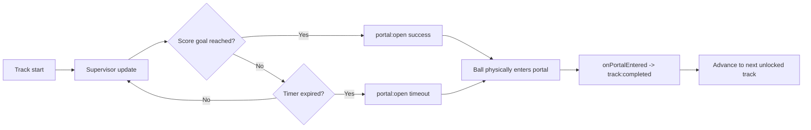

# Adventure Campaign (A/B Alternation)

This document is the canonical mental model for campaign progression.

## Source of Truth

- **Campaign progression truth:** `AdventureTrackProgression` + `AdventureProgressionSupervisor`
- **Legacy free-form progression:** `AdventureState` + `ADVENTURE_LEVELS` (level-select/reward flow)

These systems are intentionally separated to avoid silent dual-state bugs.

## A/B Pattern

Campaign rotates play style between two mode types:

- **A** = `EXTENDED_MAP`
- **B** = `STATIONARY_TABLE`

Core path:

```text
NEON_HELIX (A) -> CYBER_CORE (B) -> QUANTUM_GRID (A) -> SINGULARITY_WELL (A)
                    ^
                    |
             PACHINKO_SPIRE (B) [parallel unlock from NEON_HELIX]
```

## Portal Loop (Runtime)



## UX + Accessibility Guidance

- HUD countdown uses `TIMER_COLORS` thresholds (safe -> caution -> warning -> danger).
- Urgency pulse is suppressed when reduced motion is enabled.
- Portal flash effects and CRT flash are softened/disabled when reduced motion safety flags are active.
- Timeout copy should clearly communicate **penalized rewards** before portal entry.

## Developer Notes

- Wire campaign behavior through EventBus events:
  - `portal:open`, `portal:entered`, `track:goal-reached`, `track:timeout`, `track:completed`
- Keep `AdventureState` changes isolated unless explicitly working on legacy level-select flows.
- If both systems are touched in a PR, state the reason explicitly in code comments or PR notes.
