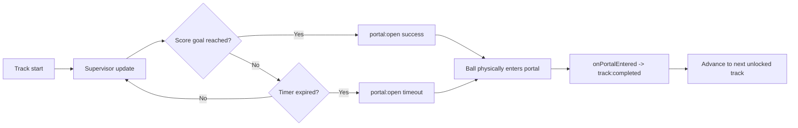

# Adventure Campaign (A/B Alternation)

This document is the canonical mental model for campaign progression.

## Source of Truth

- **Campaign progression truth:** `AdventureTrackProgression` + `AdventureProgressionSupervisor`
- **Legacy free-form progression:** `AdventureState` + `ADVENTURE_LEVELS` (level-select/reward flow)

These systems are intentionally separated to avoid silent dual-state bugs.

## Mode Identity: EXTENDED_MAP vs STATIONARY_TABLE

Campaign alternates between two **gameplay identities**, not just layout size:

| | **A — EXTENDED_MAP** | **B — STATIONARY_TABLE** |
|---|----------------------|---------------------------|
| **Fantasy** | Gravity-driven **descent run** through a pachinko parlor / holo-course | Compact **pinball arena** — dense bumpers, mills, local recycling |
| **Camera** | Follows ball along a **forward journey** (look-ahead, wide vista) | Tighter framing on a **bounded play volume** |
| **Traversal** | Long ramps, pin lanes, conveyors, chroma gates — **reach the exit arch** | Bumper clusters, rotating platforms, catch basins — **rack score in place** |
| **Controls** | No flippers (adventure ball physics only) | No flippers (same), but arena toys keep ball alive locally |
| **Portal placement** | End of course (`portalPosition` at journey terminus); larger portal mesh | Center of arena; smaller portal |
| **Runtime flag** | `gameMode = 'dynamic'` | `gameMode = 'fixed'` |
| **Examples** | Neon Helix, **Pachinko Hall** (hub), Quantum Grid, Singularity Well | Cyber Core, Pachinko Spire (parallel), Glitch Spire |

**Pachinko Hall** is the canonical EXTENDED_MAP hub prototype: a neon parlor corridor with pin forests, conveyor merge chutes, and decorative machine alcoves — inspired by classic pachinko-hall floor layouts. It bridges the spiral descent (Neon Helix) and the first pinball arena (Cyber Core).

Track builders read `currentTrackInfo.modeType` from `TRACK_CATALOG` and branch geometry accordingly (see `neon-helix.ts`, `cyber-core.ts`, `pachinko-hall.ts`).

## A/B Pattern

```text
NEON_HELIX (A) -> PACHINKO_HALL (A hub) -> CYBER_CORE (B) -> QUANTUM_GRID (A) -> SINGULARITY_WELL (A) -> GLITCH_SPIRE (B)
                    ^
                    |
             PACHINKO_SPIRE (B) [parallel unlock from NEON_HELIX]
```

Main spine order is defined in `CAMPAIGN_MAIN_PATH` (`adventure-track-progression.ts`). `getNextTrackId()` walks that array first, then optional branch tracks.

## Portal Loop (Runtime)



`portal:open` carries `mode: EXTENDED_MAP | STATIONARY_TABLE` from the active track catalog entry. `AdventureMode.activateExitPortal()` sizes the portal sensor/mesh from that mode.

## UX + Accessibility Guidance

- HUD countdown uses `TIMER_COLORS` thresholds (safe -> caution -> warning -> danger).
- Urgency pulse is suppressed when reduced motion is enabled.
- Portal flash effects and CRT flash are softened/disabled when reduced motion safety flags are active.
- Timeout copy should clearly communicate **penalized rewards** before portal entry.

## Developer Notes

- Wire campaign behavior through EventBus events:
  - `portal:open`, `portal:entered`, `track:goal-reached`, `track:timeout`, `track:completed`
- Keep `AdventureState` changes isolated unless explicitly working on legacy level-select flows.
- Canonical track load after portal entry: `LevelLoader.loadCampaignTrack()` (mode + LCD map + `switchToTrack`).
- `AdventureProgressionSupervisor.getActiveModeType()` exposes the current track's `modeType` for HUD/UI branching.
- If both systems are touched in a PR, state the reason explicitly in code comments or PR notes.
