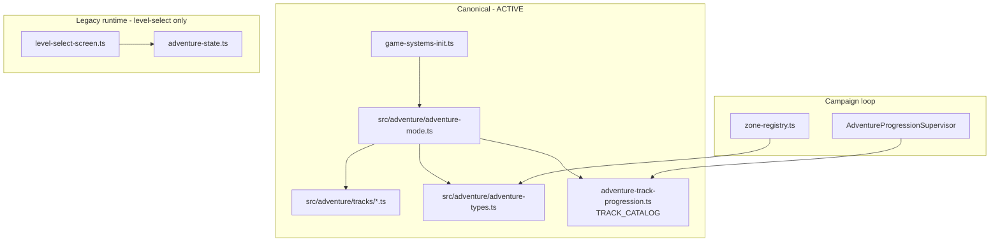

# Architecture Documentation

## Project Structure

The codebase is organized into focused modules under `src/`. See [`AGENTS.md`](../AGENTS.md) for the full module map and development commands.

### Main Entry Points

| File | Role |
|------|------|
| [`src/main.ts`](../src/main.ts) | Application bootstrap — Babylon engine (WebGPU-first), Rapier WASM preload, `Game` instantiation |
| [`src/game.ts`](../src/game.ts) | Main game orchestrator — wires subsystems, render loop, state machine |
| [`src/game/game-systems-init.ts`](../src/game/game-systems-init.ts) | Subsystem initialization (physics, adventure, campaign, display, etc.) |

### Core Subsystems

| Module | Role |
|--------|------|
| [`src/game-elements/`](../src/game-elements/) | Low-level systems: physics, input, ball manager, zone triggers, campaign progression |
| [`src/game/`](../src/game/) | High-level managers: state, input routing, maps, cabinet, UI, adventure coordination |
| [`src/objects/`](../src/objects/) | Playfield geometry: flippers, bumpers, walls, rails, pachinko pins |
| [`src/display/`](../src/display/) | Backbox display: WGSL reels (WebGPU), Canvas2D fallback, video/image layers |
| [`src/effects/`](../src/effects/) | Visual/audio effects: bloom spikes, particles, camera shake, lighting |
| [`src/materials/`](../src/materials/) | PBR material library (quality-tier aware) |
| [`src/shaders/`](../src/shaders/) | Standalone WGSL/GLSL shaders (scanlines, LCD table, CRT, jackpot overlay) |
| [`src/cabinet/`](../src/cabinet/) | Cabinet preset geometries (classic, neo, vertical, wide) |
| [`src/adventure/`](../src/adventure/) | **Canonical** adventure track builders and `AdventureMode` orchestrator |
| [`src/config.ts`](../src/config.ts) | Pure configuration (no Babylon imports) |

---

## Adventure Mode Architecture

Adventure mode has a single canonical construction stack. **Do not recreate legacy builders** — all track geometry lives under `src/adventure/tracks/`.



### Module responsibilities

| Module | Role |
|--------|------|
| [`src/adventure/`](../src/adventure/) | Track builders, `AdventureMode` orchestrator, `AdventureTrackType`, portal routing. **Single entry point** for types, catalog re-exports, and builders via [`index.ts`](../src/adventure/index.ts). |
| [`src/game-elements/adventure-track-progression.ts`](../src/game-elements/adventure-track-progression.ts) | `TRACK_CATALOG`, `AdventureTrackProgression` — campaign spine metadata (mode type, timers, unlock chain) |
| [`src/game-elements/adventure-progression-supervisor.ts`](../src/game-elements/adventure-progression-supervisor.ts) | Portal lifecycle + campaign state machine |
| [`src/game-elements/zone-registry.ts`](../src/game-elements/zone-registry.ts) | Per-track theming / story / music metadata |
| [`src/game-elements/adventure-state.ts`](../src/game-elements/adventure-state.ts) | **Legacy** level-select UI + cosmetic rewards only — not campaign truth |
| [`docs/ADVENTURE_CAMPAIGN.md`](ADVENTURE_CAMPAIGN.md) | Campaign A/B alternation reference |

### Campaign vs legacy progression

| System | Purpose |
|--------|---------|
| `AdventureTrackProgression` + `AdventureProgressionSupervisor` | **Campaign truth** — A/B alternating track loop, portal routing, unlock chain |
| `AdventureState` + `ADVENTURE_LEVELS` | **Legacy** — free-form level-select screen, cosmetic reward equip (ball trail, skin) |

These are intentionally separated. Do not add campaign features to `AdventureState`.

### Adding a new adventure track

There are two paths. Prefer **JSON** for tracks the data-driven schema can express (ramp / curve /
gap / bucket / spinner / portal primitives); fall back to a **TS builder** for flagship tracks that
need hand-tuned geometry or bespoke logic.

**JSON path (data-driven — preferred where the schema allows):**

1. Author `src/adventure/track-data/<NAME>.json` conforming to the v1 schema in
   [`src/adventure/track-schema.ts`](../src/adventure/track-schema.ts).
2. Register it in [`track-data-registry.ts`](../src/adventure/track-data-registry.ts); it is compiled
   to runtime geometry by [`track-compiler.ts`](../src/adventure/track-compiler.ts).
3. Add the catalog entry in `TRACK_CATALOG` ([`adventure-track-progression.ts`](../src/game-elements/adventure-track-progression.ts))
   plus zone config in [`zone-registry.ts`](../src/game-elements/zone-registry.ts).
4. `switchToTrack` validates fail-closed — an invalid track is rejected without tearing down physics.
   See [`docs/TRACK_SCHEMA.md`](TRACK_SCHEMA.md) for the field reference and add a case to
   [`tests/track-schema.test.ts`](../tests/track-schema.test.ts).

**TS-builder path (flagship / bespoke geometry):**

1. Add enum value in [`src/adventure/adventure-types.ts`](../src/adventure/adventure-types.ts)
2. Add catalog entry in `TRACK_CATALOG` ([`adventure-track-progression.ts`](../src/game-elements/adventure-track-progression.ts))
3. Create builder in [`src/adventure/tracks/<name>.ts`](../src/adventure/tracks/)
4. Export builder from [`src/adventure/index.ts`](../src/adventure/index.ts)
5. Register in `AdventureMode.buildTrack()` switch ([`adventure-mode.ts`](../src/adventure/adventure-mode.ts))
6. Add zone config in [`zone-registry.ts`](../src/game-elements/zone-registry.ts)
7. Add portal start anchor in [`portal-routing.ts`](../src/adventure/portal-routing.ts) if needed

> Consolidating these two paths behind a single `TrackManifest` registration surface is tracked in
> issue #320.

---

## Module Dependencies (simplified)

```
main.ts
  └── game.ts
        ├── game-elements/physics.ts
        ├── display/ (DisplaySystem)
        ├── effects/ (EffectsSystem)
        ├── objects/ (GameObjects)
        ├── game-elements/ball-manager.ts
        ├── adventure/ (AdventureMode + track builders)
        ├── game-elements/adventure-track-progression.ts (campaign)
        └── game-elements/input.ts
```

---

## Code Organization Principles

- **Keep modules focused** — Each file handles one aspect of the game
- **Use dependency injection** — Pass required dependencies to constructors
- **Maintain clear interfaces** — Public methods should be well-documented
- **Minimize coupling** — Modules should depend on interfaces, not implementations
- **No monolith creep in `game.ts`** — Feature logic belongs in the appropriate subsystem module
