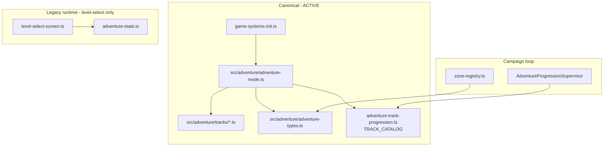

# Architecture Documentation

## Project Structure

The codebase is organized into focused modules under `src/`. See [`AGENTS.md`](../AGENTS.md) for the full module map and development commands.

### Main Entry Points

| File | Role |
|------|------|
| [`src/main.ts`](../src/main.ts) | Application bootstrap — Babylon engine (WebGPU-first), Rapier WASM preload, `Game` instantiation |
| [`src/game.ts`](../src/game.ts) | Main game orchestrator — wires subsystems, render loop, state machine |
| [`src/game/game-systems-init.ts`](../src/game/game-systems-init.ts) | Subsystem initialization (physics, adventure, campaign, display, etc.) |

### Core Subsystems

| Module | Role |
|--------|------|
| [`src/core/`](../src/core/) | **Kernel** — `EventBus` + typed event map, asset URL resolution. Engine-free; depends on nothing above it |
| [`src/game-elements/`](../src/game-elements/) | Low-level systems: physics, input, ball manager, zone triggers, campaign progression |
| [`src/game/`](../src/game/) | High-level managers: state, input routing, maps, cabinet, UI, adventure coordination |
| [`src/objects/`](../src/objects/) | Playfield geometry: flippers, bumpers, walls, rails, pachinko pins |
| [`src/display/`](../src/display/) | Backbox display: WGSL reels (WebGPU), Canvas2D fallback, video/image layers |
| [`src/effects/`](../src/effects/) | Visual/audio effects: bloom spikes, particles, camera shake, lighting |
| [`src/materials/`](../src/materials/) | PBR material library (quality-tier aware) |
| [`src/shaders/`](../src/shaders/) | Standalone WGSL/GLSL shaders (scanlines, LCD table, CRT, jackpot overlay) |
| [`src/cabinet/`](../src/cabinet/) | Cabinet preset geometries (classic, neo, vertical, wide) |
| [`src/adventure/`](../src/adventure/) | **Canonical** adventure track builders and `AdventureMode` orchestrator |
| [`src/config.ts`](../src/config.ts) | Pure configuration (no Babylon imports) |

---

## Adventure Mode Architecture

Adventure mode has a single canonical construction stack. **Do not recreate legacy builders** — all track geometry lives under `src/adventure/tracks/`.


```mermaid
flowchart TB
  subgraph canonical [Canonical - ACTIVE]
    AdventureMode["src/adventure/adventure-mode.ts"]
    TrackBuilders["src/adventure/tracks/*.ts"]
    AdventureTypes["src/adventure/adventure-types.ts"]
    TrackCatalog["adventure-track-progression.ts\nTRACK_CATALOG"]
    AdventureMode --> TrackBuilders
    AdventureMode --> AdventureTypes
    AdventureMode --> TrackCatalog
    GameSystemsInit["game-systems-init.ts"] --> AdventureMode
  end

  subgraph campaign [Campaign loop]
    Supervisor["AdventureProgressionSupervisor"]
    Supervisor --> TrackCatalog
    ZoneRegistry["zone-registry.ts"] --> AdventureTypes
  end

  subgraph legacyRuntime [Legacy runtime - level-select only]
    AdventureState["adventure-state.ts"]
    LevelSelect["level-select-screen.ts"] --> AdventureState
  end
```

### Module responsibilities

| Module | Role |
|--------|------|
| [`src/adventure/`](../src/adventure/) | Track builders, `AdventureMode` orchestrator, `AdventureTrackType`, portal routing. **Single entry point** for types, catalog re-exports, and builders via [`index.ts`](../src/adventure/index.ts). |
| [`src/game-elements/adventure-track-progression.ts`](../src/game-elements/adventure-track-progression.ts) | `TRACK_CATALOG`, `AdventureTrackProgression` — campaign spine metadata (mode type, timers, unlock chain) |
| [`src/game-elements/adventure-progression-supervisor.ts`](../src/game-elements/adventure-progression-supervisor.ts) | Portal lifecycle + campaign state machine |
| [`src/game-elements/zone-registry.ts`](../src/game-elements/zone-registry.ts) | Per-track theming / story / music metadata |
| [`src/game-elements/adventure-state.ts`](../src/game-elements/adventure-state.ts) | **Legacy** level-select UI + cosmetic rewards only — not campaign truth |
| [`docs/ADVENTURE_CAMPAIGN.md`](ADVENTURE_CAMPAIGN.md) | Campaign A/B alternation reference |

### Campaign vs legacy progression

| System | Purpose |
|--------|---------|
| `AdventureTrackProgression` + `AdventureProgressionSupervisor` | **Campaign truth** — A/B alternating track loop, portal routing, unlock chain |
| `AdventureState` + `ADVENTURE_LEVELS` | **Legacy** — free-form level-select screen, cosmetic reward equip (ball trail, skin) |

These are intentionally separated. Do not add campaign features to `AdventureState`.

### Adding a new adventure track

Register a track through the **TrackManifest** surface in `src/adventure/manifests/`.
One manifest entry replaces the old scattered edits (enum, catalog, zone registry,
portal anchors, and `buildTrack()` switch case).

**Steps:**

1. Add the enum value in [`adventure-types.ts`](../src/adventure/adventure-types.ts)
   (`AdventureTrackType`).
2. Add a manifest entry in [`track-manifest-data.ts`](../src/adventure/manifests/track-manifest-data.ts):
   - `startAnchor` — portal teleport position
   - `zone` — story text, colors, music, transition flags (feeds `ZONE_REGISTRY`)
   - `catalog` — optional campaign metadata (feeds `TRACK_CATALOG` when present)
   - `cameraPresetId` — optional `CAMERA_PRESETS` key (defaults to the track id, then `DEFAULT`)
   - `buildKind` — `'json'` or `'ts'`, plus that kind's dispatch field (below)
3. **JSON path** (`buildKind: 'json'`):
   - Author `src/adventure/track-data/<NAME>.json` conforming to the v1 schema in
     [`track-schema.ts`](../src/adventure/track-schema.ts).
   - Point the manifest's `dataPath` at it (glob-relative, e.g. `./track-data/<NAME>.json`).
   - The file is auto-registered via `track-data-registry.ts` (`import.meta.glob`); the
     manifest registry cross-checks `dataPath` against the file the definition actually
     came from, so a typo or rename fails loudly at startup.
   - See [`docs/TRACK_SCHEMA.md`](TRACK_SCHEMA.md) for the field reference.
4. **TS-builder path** (`buildKind: 'ts'`):
   - Create the builder in [`src/adventure/tracks/<name>.ts`](../src/adventure/tracks/)
   - Reference it directly as the manifest's `builder` — there is no separate
     dispatch table to update.
   - Export from [`src/adventure/index.ts`](../src/adventure/index.ts) if needed externally.
5. `switchToTrack` validates JSON tracks fail-closed — an invalid track is rejected
   without tearing down physics. `buildTrack` likewise refuses to build (and records
   `getLastTrackLoadError()`) rather than leaving an empty world.
6. Add coverage in [`tests/track-manifest.test.ts`](../tests/track-manifest.test.ts)
   and [`tests/track-schema.test.ts`](../tests/track-schema.test.ts) as appropriate.

`TrackManifest` is a discriminated union on `buildKind`: a `'ts'` entry must supply a
`builder`, a `'json'` entry a `dataPath`, so the compiler rejects a half-registered
track. `TRACK_CATALOG` and `ZONE_REGISTRY` are **derived** from manifests — do not edit
them directly. `AdventureMode.buildTrack()` dispatches via `getTrackManifest()` — no
switch case needed.

---

## Module Dependencies (simplified)

```
main.ts
  └── game.ts
        ├── game-elements/physics.ts
        ├── display/ (DisplaySystem)
        ├── effects/ (EffectsSystem)
        ├── objects/ (GameObjects)
        ├── game-elements/ball-manager.ts
        ├── adventure/ (AdventureMode + track builders)
        ├── game-elements/adventure-track-progression.ts (campaign)
        └── game-elements/input.ts
```

---

## Code Organization Principles

- **Keep modules focused** — Each file handles one aspect of the game
- **Use dependency injection** — Pass required dependencies to constructors
- **Maintain clear interfaces** — Public methods should be well-documented
- **Minimize coupling** — Modules should depend on interfaces, not implementations
- **No monolith creep in `game.ts`** — Feature logic belongs in the appropriate subsystem module

### Layering

Dependencies point one way:

```text
src/core/  ←  src/game-elements/  ←  src/game/
  kernel        low-level systems      orchestration
```

| Layer | May depend on | Must not |
|-------|---------------|----------|
| `src/core/` | nothing above it | Babylon, `src/game/**`; runtime imports from `src/game-elements/**` (erased `import type` is allowed for event-map payloads) |
| `src/game-elements/` | `src/core/`, peers | `src/game/**` — anything at all |
| `src/game/` | everything below | — |

Both rules are enforced by `@typescript-eslint/no-restricted-imports` in
[`eslint.config.js`](../eslint.config.js), so a violation fails `npm run lint`
rather than relying on review to catch it.

If a `game-elements` module needs a type from a game-layer class, **declare the
shape it actually uses locally** instead of importing the class — structural
typing means callers keep passing the concrete object unchanged. See
`TrackThemingMapSource` in
[`track-theming-system.ts`](../src/game-elements/track-theming-system.ts), which
replaced an import of `TableMapManager` used only for `getCurrentConfig()`.
