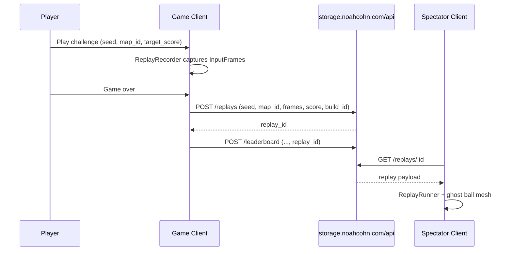

# Async Challenges & Replay Spectate (P3 Epic)

**Status:** Direction-setting only — **do not implement until foundation issues close.**  
**Priority:** P3  
**Related issues:** #297 (replay), #304 (procedural mutator), #292 (lane sensors), #288 (deploy/API auth), #298 (PWA — optional for share links)

---

## Summary

Extend the existing leaderboard + name-entry flow into a **live arcade service** starting with **async challenges**: share a seed and target score, upload a deterministic input replay, and let friends download and watch a ghost run on the same layout. v1 is **upload / download / spectate** — no real-time netcode.

Later phases add weekly tournament APIs and (optionally) true realtime co-op multiball — explicitly **out of scope for v1**.

---

## Long-term vision

| Phase | Feature | Depends on |
|-------|---------|------------|
| **v1 (this epic)** | Async challenges — seed + target score + replay upload; ghost spectate on another client | Deterministic replay, API storage, scoring reliability |
| **v2** | Spectate replays — stream recorded input frames to passive observers (polling or SSE; still no netcode) | v1 replay format + stable ghost renderer |
| **v3** | Weekly tournament API — extend `api/` + `storage.noahcohn.com` contracts (brackets, windows, anti-cheat hooks) | v1 + auth hygiene |
| **Future** | True realtime co-op multiball (Babylon + Rapier authority server) | High complexity — **not v1** |

---

## What exists today

### Client (ready to extend)

| Asset | Location | Notes |
|-------|----------|-------|
| Leaderboard UI + polling | `src/game-elements/leaderboard-system.ts` | `GET/POST /leaderboard`, map-filtered, 3-letter names via submission payload |
| Name entry dialog | `src/game-elements/name-entry-dialog.ts` | Shown on game over when score ranks in top 100 |
| Game-over submission wiring | `src/game/game-hud.ts` → `handleGameOverLeaderboard()` | Submits `name`, `score`, `map_id`, `balls`, `combo_max` — **no `replay_id` yet** |
| Input frame schema | `src/game-elements/types.ts` → `InputFrame` | Per-physics-frame flipper/plunger/nudge deltas + timestamp |
| Input buffering | `src/game-elements/input.ts` | `processBufferedInputs()` aligns input to physics frames |
| Physics fixed timestep | `src/game-elements/physics.ts` | `FIXED_TIMESTEP = 1/60`, accumulator pattern |
| API helper | `src/config.ts` → `apiFetch()` | Prod base: `https://storage.noahcohn.com/api` |

### Backend (minimal)

| Asset | Location | Notes |
|-------|----------|-------|
| Adventure progress stub | `api/adventure.py` | File/GCS progress only — **no leaderboard or replay endpoints in-repo** |
| Leaderboard API | External (`storage.noahcohn.com`) | Consumed by client; contract not versioned in this repo |

### Missing (v1 blockers)

- No replay recorder or ghost playback system
- No seeded RNG for gameplay-affecting randomness (`Math.random` in `ball-manager.ts`, slot machine, feeders)
- No procedural layout mutator (#304) — challenges need a canonical seed → layout mapping
- Leaderboard entries do not link to replays
- Deploy credentials still hardcoded in `deploy.py` (#288) — replay uploads need auth before public launch

---

## Foundation dependencies (must close first)

These are **hard gates** for v1 acceptance. Do not start replay work in parallel with unfixed determinism or unscored drains.

### 1. Deterministic replay (#297)

**Goal:** Same seed + same input frame stream → same score and ball positions on any client (WebGL2 path first; WebGPU ghost visuals can diverge cosmetically).

**Current gaps:**

- `InputFrame` exists but is **not recorded** anywhere
- Gameplay uses unseeded `Math.random()` (ball spawn jitter, type weights, slot spins, multiball spread)
- Fixed timestep exists in `PhysicsSystem`, but render/physics coupling and WASM A/B mirror (`WasmMirror`) must be excluded or locked for replay mode
- Feeder FSMs have golden fixtures (`tests/feeder-golden-fixtures.test.ts`) — replay harness should reuse that pattern

**Deliverables before v1 coding:**

- [ ] `ReplayRecorder` — append-only `InputFrame[]` + metadata each physics tick while `PLAYING`
- [ ] `SeededRng` — injectable RNG replacing `Math.random` on gameplay paths (ball spawn, slot, feeders)
- [ ] `ReplayRunner` — feed recorded frames into `applyInputFrame`; disable live input
- [ ] Parity test: record N frames → replay → assert final score + ball position within epsilon

### 2. Procedural mutator (#304)

Async challenges require a **shareable seed** that deterministically selects layout variants (bumper positions, pachinko pin density, etc.). Until the mutator exists, v1 can scope to **fixed map_id only** (e.g. `neon-helix`) with seed reserved for future pin-field variation.

### 3. Scoring reliability (#292 — Phase 2 of #266)

Lane/rollover sensor fallback ensures every ball registers at least one score event even on edge drains. Without this, replay-verified scores may disagree with live play when balls miss handle-space collisions.

### 4. Deploy / API auth hygiene (#288)

Replay blobs will be user-uploaded binary/JSON. Before public write access:

- Move `deploy.py` credentials to environment variables
- Add upload auth (API key, signed URL, or rate-limited anonymous with size caps)
- Define retention and GDPR deletion policy for replay payloads

---

## v1 architecture (proposed)



### Client modules (new)

| Module | Responsibility |
|--------|----------------|
| `src/game-elements/replay-recorder.ts` | Record `InputFrame[]`, frame index, `build_id`, `map_id`, `seed` |
| `src/game-elements/replay-runner.ts` | Deterministic playback; ghost ball visual; disables live input |
| `src/game-elements/replay-types.ts` | `ReplayPayload`, `ReplayMetadata`, versioning |
| `src/game-elements/challenge-system.ts` | Parse share URL (`?challenge=seed:target`), orchestrate record/upload |
| Extend `leaderboard-system.ts` | `replay_id` on entries; click → open spectate mode |
| Extend `game-hud.ts` | Upload replay after name entry, attach `replay_id` to score POST |

### Replay payload schema (draft v1)

```typescript
interface ReplayPayload {
  version: 1
  build_id: string          // git SHA or package version — mismatch = warn, not hard fail
  map_id: string
  seed: number              // u32; 0 = fixed layout (pre-mutator)
  target_score?: number     // challenge mode only
  physics_fps: 60
  frames: InputFrame[]
  final_score: number
  balls: number
  combo_max: number
  recorded_at: string       // ISO-8601
  client_renderer: 'webgl2' | 'webgpu'
}
```

**Storage:** gzip JSON or MessagePack; cap at ~500 KB per run (≈ 3 min @ 60 fps × ~80 bytes/frame). Reject larger server-side.

### API contracts (draft — extend `storage.noahcohn.com`)

#### `POST /api/replays`

Request: `ReplayPayload` (gzip optional via `Content-Encoding: gzip`)

Response:

```json
{ "success": true, "replay_id": "r_8f3a2c1b", "bytes": 42180 }
```

#### `GET /api/replays/:replay_id`

Response: `ReplayPayload` + optional `player_name` if linked to leaderboard.

#### `POST /api/leaderboard` (extend existing)

Add optional field:

```json
{ "name": "AAA", "score": 125000, "map_id": "neon-helix", "replay_id": "r_8f3a2c1b", ... }
```

#### `GET /api/leaderboard` (extend existing)

Each entry may include `replay_id`. UI renders a ▶ control when present.

#### Share URL (client-only, no new endpoint)

```
https://pachinball.example/?challenge=<seed>:<target_score>&map=neon-helix
```

Loading this URL starts a seeded run; on game over, prompt to beat the target and upload replay.

---

## v1 acceptance criteria

- [ ] **Upload replay + seed to API** — `POST /replays` after qualifying game over; payload includes seed, map, frames, score
- [ ] **Download and watch ghost on another client** — `GET /replays/:id` drives `ReplayRunner` with visible ghost ball
- [ ] **Leaderboard entry links to replay id** — submission stores `replay_id`; leaderboard row opens spectate mode

---

## Out of scope (v1)

- Real-time multiplayer / shared multiball
- Server-side physics verification (trust client score with replay attached; anti-cheat is v3)
- Weekly tournament brackets
- Adventure-mode replays (table mode only initially)
- WebGPU canvas capture in Playwright — spectate E2E uses `?renderer=webgl2`

---

## Suggested implementation order (after foundation closes)

1. **#297 core** — `ReplayRecorder` + `ReplayRunner` + Vitest parity test (no network)
2. **#292** — lane sensor scoring so `final_score` in replay matches live play
3. **API stub** — add `api/replays.py` mirroring `api/adventure.py` pattern; wire to GCS
4. **Client upload** — extend `handleGameOverLeaderboard()` flow
5. **Spectate mode** — leaderboard ▶ button + direct `?replay_id=` URL
6. **#304 mutator** — wire seed into layout; bump `ReplayPayload.version` to 2
7. **#298 PWA** — offline cache of downloaded replays (optional polish)

---

## Testing strategy

| Layer | Approach |
|-------|----------|
| Unit | Record → replay → score/position parity (Vitest, mocked physics or fixed Rapier scene) |
| Golden | Extend `feeder-golden-fixtures.test.ts` pattern for full 10 s input scripts |
| E2E | Playwright: submit score with mock API, open `?replay_id=fixture`, assert ghost visible (`?renderer=webgl2`) |

---

## Risk register

| Risk | Mitigation |
|------|------------|
| Cross-browser physics drift | Lock replay to `webgl2`; document `build_id` mismatch warnings |
| Replay size / abuse | Server cap + rate limit; auth before public write |
| Slot machine nondeterminism | Exclude slot spins from v1 challenge mode, or seed slot RNG from challenge seed |
| WASM A/B path | Force Rapier-only during record and playback |

---

**Last updated:** 2026-07-23  
**Owner:** TBD — assign when #297 foundation closes
