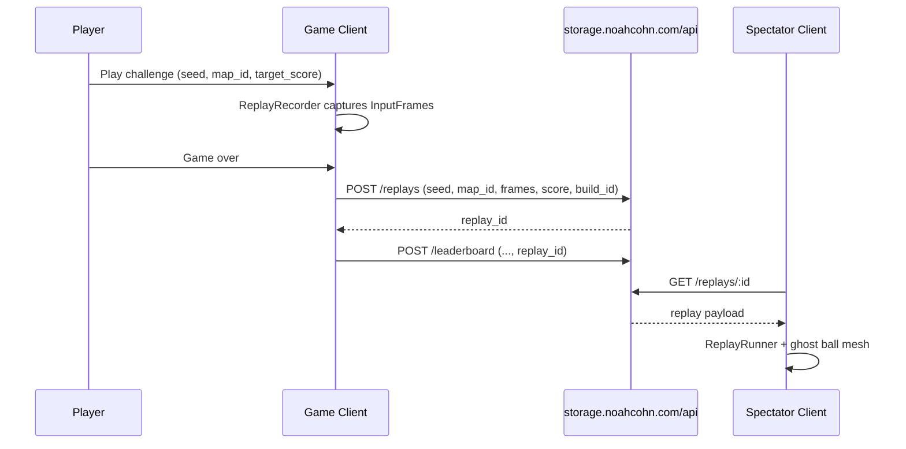

# Async Challenges & Replay Spectate (P3 Epic)

**Status:** **v1 Implemented** (Client share links, RLE compression, API contract in `api/replays.py`, Leaderboard ▶ spectate button, `GhostBallRenderer`). **Challenges v2 in progress (#431):** C++ solver snapshots, replay world fingerprint, divergence toast.  
**Priority:** P3  
**Related issues:** #297 (replay), #304 (procedural mutator), #292 (lane sensors), #288 (deploy/API auth), #322 / #340 (Async Challenges v1)

---

## Summary

Extend the existing leaderboard + name-entry flow into a **live arcade service** starting with **async challenges**: share a seed and target score, upload a deterministic input replay, and let friends download and watch a ghost run on the same layout. v1 is **upload / download / spectate** — no real-time netcode.

Later phases add weekly tournament APIs and (optionally) true realtime co-op multiball — explicitly **out of scope for v1**.

---

## Long-term vision

| Phase | Feature | Depends on |
|-------|---------|------------|
| **v1 (this epic)** | Async challenges — seed + target score + replay upload; ghost spectate on another client | Deterministic replay, API storage, scoring reliability |
| **v2** | Spectate replays — stream recorded input frames to passive observers (polling or SSE; still no netcode) | v1 replay format + stable ghost renderer |
| **v3** | Weekly tournament API — extend `api/` + `storage.noahcohn.com` contracts (brackets, windows, anti-cheat hooks) | v1 + auth hygiene |
| **Future** | True realtime co-op multiball (Babylon + Rapier authority server) | High complexity — **not v1** |

---

## What exists today

### Client (ready to extend)

| Asset | Location | Notes |
|-------|----------|-------|
| Leaderboard UI + polling | `src/game-elements/leaderboard-system.ts` | `GET/POST /leaderboard`, map-filtered, 3-letter names via submission payload |
| Name entry dialog | `src/game-elements/name-entry-dialog.ts` | Shown on game over when score ranks in top 100 |
| Game-over submission wiring | `src/game/game-hud.ts` → `handleGameOverLeaderboard()` | `POST /replays` first, then submits `name`, `score`, `map_id`, `balls`, `combo_max`, **`replay_id`** |
| Replay recorder / runner / ghost | `src/replay/` | `ReplayRecorder` (append-only `InputFrame[]` while `PLAYING`, RLE JSON), `ReplayRunner`, `GhostBallRenderer`, `ChallengeSystem` |
| Seeded RNG | `src/core/seeded-rng.ts` | Mulberry32 session RNG, named forks, keyed `getLayoutRng` — catalogue in `docs/determinism-todo.md` |
| Replay ↔ C++ snapshot | `src/replay/replay-snapshot.ts` | World fingerprint, frame-0 snapshot restore, divergence toast (#431) |
| Input frame schema | `src/game-elements/types.ts` → `InputFrame` | Per-physics-frame flipper/plunger/nudge deltas + timestamp |
| Input buffering | `src/game-elements/input.ts` | `processBufferedInputs()` aligns input to physics frames |
| Physics fixed timestep | `src/game-elements/physics.ts` | `FIXED_TIMESTEP = 1/60`, accumulator pattern |
| API helper | `src/config.ts` → `apiFetch()` | Prod base: `https://storage.noahcohn.com/api` |

### Backend (minimal)

| Asset | Location | Notes |
|-------|----------|-------|
| Adventure progress stub | `api/adventure.py` | File/GCS progress only |
| Replay storage | `api/replays.py` | `POST /api/replays` (assigns `replay_id`), `GET /api/replays/{replay_id}` — stores the payload verbatim, so the #431 fingerprint fields ride along |
| Leaderboard API | External (`storage.noahcohn.com`) | Consumed by client; accepts `replay_id` on submit; contract not versioned in this repo |

### Missing

- ~~No replay recorder or ghost playback system~~ — `src/replay/` (`ReplayRecorder`, `ReplayRunner`, `GhostBallRenderer`)
- ~~No seeded RNG for gameplay-affecting randomness~~ — `src/core/seeded-rng.ts`; every physics-affecting `Math.random` is gone (`docs/determinism-todo.md`)
- ~~Leaderboard entries do not link to replays~~ — `handleGameOverLeaderboard()` submits `replay_id`
- ~~No solver state in replays~~ — the frame-0 C++ snapshot + world fingerprint (#431, below)
- No procedural layout mutator (#304) beyond the Daily Cascade pin lattice — challenges map `seed` → session RNG, not yet → table variant
- Deploy credentials still hardcoded in `deploy.py` (#288) — replay uploads need auth before public launch
- Spectating does not yet restore across a differing ball-id layout (the spectator's ids were allocated by earlier games); it says so (`id-layout` toast) and plays the tape unverified

---

## Foundation dependencies (must close first)

These are **hard gates** for v1 acceptance. Do not start replay work in parallel with unfixed determinism or unscored drains.

### 1. Deterministic replay (#297)

**Goal:** Same seed + same input frame stream → same score and ball positions on any client (WebGL2 path first; WebGPU ghost visuals can diverge cosmetically).

**Current gaps:**

- ~~`InputFrame` exists but is **not recorded** anywhere~~ — recorded every physics step while `PLAYING`
- ~~Gameplay uses unseeded `Math.random()`~~ — seeded forks + keyed layout streams (`docs/determinism-todo.md`)
- ~~Replay is input log + hope~~ — the C++ world snapshot (`native/src/Snapshot.h`) pins solver state at frame 0; `tests/replay-snapshot-wasm.test.ts` replays score + ball pose bit-for-bit from it
- Scoring debounce runs on the simulation clock (was `performance.now()`); nudge / tilt timing is still wall-clock — see `docs/determinism-todo.md`
- Feeder FSMs have golden fixtures (`tests/feeder-golden-fixtures.test.ts`); the feeder tunables hash in replay metadata flags a retune

**Deliverables before v1 coding:**

- [x] `ReplayRecorder` — append-only `InputFrame[]` + metadata each physics tick while `PLAYING`
- [x] `SeededRng` — session RNG replacing `Math.random` on gameplay paths (ball spawn, slot, feeders)
- [x] `ReplayRunner` — feed recorded frames into `applyInputFrame`; disable live input
- [x] Parity test: record N frames → replay → assert final score + ball position within epsilon
- [x] Snapshot parity (#431): record on wasm-owner → restore frame-0 snapshot in a fresh client → replay → score + ball WASM-id pose bit-for-bit (`tests/replay-snapshot-wasm.test.ts`)

### 2. Procedural mutator (#304)

Async challenges require a **shareable seed** that deterministically selects layout variants (bumper positions, pachinko pin density, etc.). Until the mutator exists, v1 can scope to **fixed map_id only** (e.g. `neon-helix`) with seed reserved for future pin-field variation.

### 3. Scoring reliability (#292 — Phase 2 of #266)

Lane/rollover sensor fallback ensures every ball registers at least one score event even on edge drains. Without this, replay-verified scores may disagree with live play when balls miss handle-space collisions.

### 4. Deploy / API auth hygiene (#288)

Replay blobs will be user-uploaded binary/JSON. Before public write access:

- Move `deploy.py` credentials to environment variables
- Add upload auth (API key, signed URL, or rate-limited anonymous with size caps)
- Define retention and GDPR deletion policy for replay payloads

---

## v1 architecture (proposed)


```mermaid
sequenceDiagram
  participant Player
  participant Game as Game Client
  participant API as storage.noahcohn.com/api
  participant Spectator as Spectator Client

  Player->>Game: Play challenge (seed, map_id, target_score)
  Game->>Game: ReplayRecorder captures InputFrames
  Player->>Game: Game over
  Game->>API: POST /replays (seed, map_id, frames, score, build_id)
  API-->>Game: replay_id
  Game->>API: POST /leaderboard (..., replay_id)
  Spectator->>API: GET /replays/:id
  API-->>Spectator: replay payload
  Spectator->>Spectator: ReplayRunner + ghost ball mesh
```

### Client modules (new)

| Module | Responsibility |
|--------|----------------|
| `src/replay/replay-recorder.ts` | Record `InputFrame[]`, `build_id`, `map_id`, `seed`, `physicsEngine`, world fingerprint; `ReplayPayload` / `ReplayMetadata` |
| `src/replay/replay-runner.ts` | Deterministic playback; hands the frame-0 fingerprint to the physics step once |
| `src/replay/replay-snapshot.ts` | Fingerprint capture, snapshot restore gate, divergence toast (#431) |
| `src/replay/challenge-system.ts` | Parse share URL (`?challenge=seed:target`, `?seed=`); the seed becomes the session seed in `startGame()` |
| Extend `leaderboard-system.ts` | `replay_id` on entries; click → open spectate mode |
| Extend `game-hud.ts` | Upload replay after name entry, attach `replay_id` to score POST |

### Replay payload schema (draft v1)

```typescript
interface ReplayPayload {
  version: 1
  build_id: string          // git SHA or package version — mismatch = warn, not hard fail
  map_id: string
  seed: number              // u32; 0 = fixed layout (pre-mutator)
  target_score?: number     // challenge mode only
  physics_fps: 60
  frames: InputFrame[]
  final_score: number
  balls: number
  combo_max: number
  recorded_at: string       // ISO-8601
  client_renderer: 'webgl2' | 'webgpu'
}
```

**Storage:** gzip JSON or MessagePack; cap at ~500 KB per run (≈ 3 min @ 60 fps × ~80 bytes/frame). Reject larger server-side.

### API contracts (draft — extend `storage.noahcohn.com`)

#### `POST /api/replays`

Request: `ReplayPayload` (gzip optional via `Content-Encoding: gzip`)

Response:

```json
{ "success": true, "replay_id": "r_8f3a2c1b", "bytes": 42180 }
```

#### `GET /api/replays/:replay_id`

Response: `ReplayPayload` + optional `player_name` if linked to leaderboard.

#### `POST /api/leaderboard` (extend existing)

Add optional field:

```json
{ "name": "AAA", "score": 125000, "map_id": "neon-helix", "replay_id": "r_8f3a2c1b", ... }
```

#### `GET /api/leaderboard` (extend existing)

Each entry may include `replay_id`. UI renders a ▶ control when present.

#### Share URL (client-only, no new endpoint)

```
https://pachinball.example/?challenge=<seed>:<target_score>&map=neon-helix
```

Loading this URL starts a seeded run; on game over, prompt to beat the target and upload replay.

---

---

## Challenges v2 — solver snapshots (#431)

A replay now carries the world it was played on, not just the tape:

| Field (camelCase; snake_case accepted on read) | Meaning |
|-------|---------|
| `physicsEngine` | `rapier` / `wasm-mirror` / `wasm-owner` / `wasm-worker` |
| `snapshotVersion` | `WASM_SNAPSHOT_VERSION` (1) when a snapshot was taken; 0 when the engine could not snapshot (Rapier, worker) |
| `staticHash` | FNV-1a 64 of the C++ static table (`getStaticContentHash()`), 16 hex |
| `pinFieldOccupancy` | FNV-1a of every resolved pin (index + position) of every pin field; null without one |
| `feederTunablesHash` | FNV-1a of `FEEDER_TUNABLES` |
| `initialSnapshot` | Base64 `serializeSnapshot()` taken right before the physics step of frame 0 |

Capture happens in `PhysicsController.stepPhysics` on the step that records
frame 0 (after that frame's flipper / mover inputs, before the step), so a
Daily Cascade rebuild exported at start is in the hash. Playback restores at
the same point of the first replayed step via `applyReplaySnapshot`, which
never forces a restore it cannot trust:

| Outcome | When | Toast |
|---------|------|-------|
| `restored` | Table hash, tunables and live body ids all match | — |
| `no-snapshot` | v1 replay or a Rapier recording: tape only | — |
| `table-mismatch` | `staticHash` or the blob's hash differs; native `StaticMismatch` | "table differs from the recording (snapshot hash mismatch)" |
| `tunables-mismatch` | Feeder tuning changed since recording | yes |
| `id-layout` | Same table, but the live C++ ids differ from the snapshot's (restoring would alias bodies) | yes |
| `unsupported` | Engine cannot restore (worker path, pre-#431 bundle) | yes |
| `invalid` | Truncated / corrupt / other version | yes |

`<body data-replay-divergence="<outcome>">` is set on every check for
Playwright. The snapshot covers the C++ solver only; TS gameplay state (combo,
flipper hold timers) starts from its spawn values, which is what `startGame()`
gives the live recording too.

Tests: `tests/replay-snapshot.test.ts` (gate logic, JSON round trip, toast),
`tests/replay-snapshot-wasm.test.ts` (compiled bundle, `RUN_WASM_PARITY=1`),
`tests/replay-seed-determinism.spec.ts` (`?seed=12345` twice → same bumper
hits over a fixed tape), native `snapshot_test.cpp` + `npm run test:wasm-parity`.

---

## v1 acceptance criteria

- [x] **Upload replay + seed to API** — `POST /replays` after qualifying game over; payload includes seed, map, frames/compressedFrames, score
- [x] **Download and watch ghost on another client** — `GET /replays/:id` drives `ReplayRunner` with `GhostBallRenderer`
- [x] **Leaderboard entry links to replay id** — submission stores `replay_id`; leaderboard row ▶ button opens spectate mode
- [x] **Shareable Challenge Links** — `?challenge=<seed>:<target>` / `?seed=...` loads challenge run; "Challenge Friends" UI button copies URL

---

## Out of scope (v1)

- Real-time multiplayer / shared multiball
- Server-side physics verification (trust client score with replay attached; anti-cheat is v3)
- Weekly tournament brackets
- Adventure-mode replays (table mode only initially)
- WebGPU canvas capture in Playwright — spectate E2E uses `?renderer=webgl2`

---

## Residual risks & mitigations

| Risk | Status | Mitigation |
|------|--------|------------|
| Cross-browser physics non-determinism | Mitigated | WebGL2 & Rapier forced for spectate validation; `build_id` mismatch warnings logged |
| Replay payload size / bandwidth | Mitigated | Zero-dependency RLE delta frame compression (`compressInputFrames`) + 512 KB API cap |
| Server-side replay verification | Deferred (v3) | Client-uploaded replays attached to leaderboard; anti-cheat verification deferred to v3 |
| Slot machine non-determinism | Mitigated | Slot machine triggers use `getSessionRng()` |

---

**Last updated:** 2026-08-07  
**Owner:** Core Engineering  
