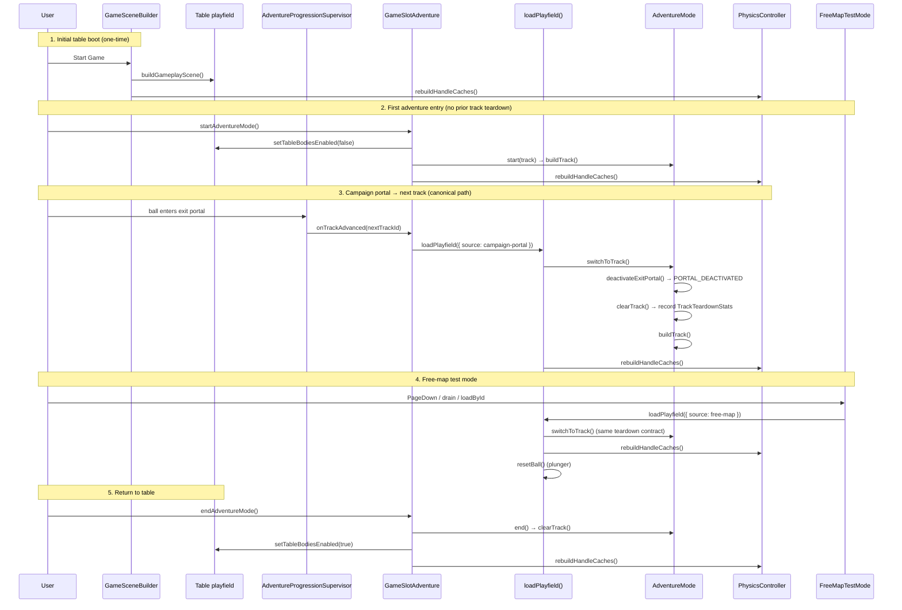

# Playfield Load / Teardown API

Single authority for in-session adventure layout switches. All campaign portal
jumps, free-map test loads, and dev track cycling MUST go through
`loadPlayfield()` in `src/game/playfield-loader.ts`.

Initial table boot (`GameSceneBuilder.buildGameplayScene`) and table-return
(`GameSlotAdventure.endAdventureMode`) are separate entry points — they do not
call `loadPlayfield()`.

---

## Entry-point sequence diagram



---

## API

### `loadPlayfield(spec, deps)`

```typescript
import { loadPlayfield, type PlayfieldSpec } from './playfield-loader'

const result = loadPlayfield(
  { trackId: 'CYBER_CORE', source: 'campaign-portal' },
  deps,
)

if (result.success) {
  console.log(result.teardown) // TrackTeardownStats from prior layout
}
```

| Field | Type | Description |
|-------|------|-------------|
| `trackId` | `string` | Adventure track id (`AdventureTrackType` value) |
| `source` | `PlayfieldLoadSource` | `campaign-portal` \| `free-map` \| `dev-cycle` \| `table-return` |
| `resetBallToPlunger` | `boolean?` | Default `true` for free-map, `false` for campaign |
| `syncGameMode` | `boolean?` | Default `true` for campaign (A/B `fixed`/`dynamic`) |
| `syncTableMap` | `boolean?` | Default `true` for campaign (LCD shader map) |

### `LevelLoader` (facade)

`LevelLoader` delegates to `loadPlayfield()`:

| Method | Maps to |
|--------|---------|
| `loadCampaignTrack(id)` | `loadPlayfield({ source: 'campaign-portal' })` |
| `loadMap(id)` | `loadPlayfield({ source: 'free-map' })` |
| `loadAdventureTrack(type)` | `loadPlayfield({ source: 'free-map', sync*: false })` |

---

## Teardown contract

`AdventureMode.switchToTrack()` always runs teardown before build:

| Step | Owner | Resources removed |
|------|-------|-------------------|
| 1 | `deactivateExitPortal()` | Exit portal mesh, portal Rapier sensor; emits `PORTAL_DEACTIVATED` → `unregisterPortalSensor()` |
| 2 | `clearTrack()` | Adventure meshes/materials, rigid bodies, conveyor/gravity/damping zones, reset sensors, chroma gates, adventure sensor |
| 3 | `rebuildHandleCaches()` | Refreshes collision-dispatch handle maps (caller, via `loadPlayfield`) |

Instrumentation: `AdventureMode.getLastTeardownStats()` returns `TrackTeardownStats`
after every `clearTrack()`. Counters are defined in
`src/game-elements/track-teardown-stats.ts` (`PLAYFIELD_TEARDOWN_FIELDS`).

**Acceptance:** `lingeringBodies === 0` after every load. A double-load must not
accumulate Rapier bodies — teardown removes all adventure-owned handles before
`buildTrack()` registers new ones.

---

## Callers (do / don't)

| Caller | Path | Correct? |
|--------|------|----------|
| `GameSlotAdventure.switchToTrack` | `LevelLoader.loadCampaignTrack` → `loadPlayfield` | ✅ |
| `FreeMapTestMode.loadCurrentMap` | `LevelLoader.loadMap` → `loadPlayfield` | ✅ |
| `AdventureProgressionSupervisor.onPortalEntered` | → `slotAdventure.switchToTrack` | ✅ |
| `GameSlotAdventure.startAdventureMode` | `adventureMode.start()` (first entry, no teardown) | ✅ (by design) |
| Direct `adventureMode.switchToTrack()` | Bypasses mode/map sync + cache rebuild | ❌ |
